# KIM ML Model Driver

 `TorchMLModelDriver` is the base driver needed for [COLABFIT portable models](https://github.com/ipcamit/colabfit-portable-models). 
This repository will contain a core model driver, that would provide easy one-place solution to rapidly
develop and test various iterations/ideas for the model driver, and also test their conflicts/incompatibilities.
For actual application and "production", a specialized model driver can be easily derived from the core library, by removing 
unnecessary components (for example, see branch [`just-graph-nn`](https://github.com/ipcamit/colabfit-model-driver/tree/just-graph-nn) 
 for a minimal dependency GNN driver). 



## Dependencies
Model driver depends on several libraries for it to functions seamlessly. And it expects them to be
provided by the user at runtime. The core requirement of ML model driver is `libtorch` library that provides the interface
between the KIM model driver's C++ API and the TorchScript models. For Graph Neural Networks, the Torch model
shall use [Pytorch Geometric Library](https://github.com/pyg-team/pytorch_geometric). The C++ API of Pytorch Geometric lib
depends upon `torch-scatter` and `torch-sparse` libraries, for which there is a simple installation script has been provided
in `torch_geometric_dependencies` folder (details in Install section). Descriptor support needs Enzyme AD support for 
gradients computation.

Summary of dependencies:
- libtorch (CXX11 ABI, v1.11)
- KIM-API (v2.3)
- libdescriptor (0.0.1)
- Enzyme AD (0.0.41)
- libtorchscatter (18d3759)
- libtorchsparse  (aeca5cf)

At present lot of these dependencies are tied to my dev environment, but soon they will be a more independent CMake project.

## Install
As it is a KIM model, installation is simply cloning the repo and installing it as KIM model:
```shell
git clone https:github.com/ipcamit/colabfit-model-driver
kim-api-collections-management install user colabfit-model-driver
```
That is it! if all dependencies are met, that is all you need to make it work. Your shell environment should provide
require variables for dependency resolution namely,
1. `TORCH_ROOT` 
2. `TorchScatter_ROOT` 
3. `TorchSparse_ROOT`
4. `LIBDESCRIPTOR_ROOT`

`libtorch` is simple to install, you need not build it from source, but rather just download them libtorch binaries from
PyTorch website, and put them at appropriate system paths.

`libtorchscatter` and `libtorchsparse` can be installed by going in to `torch_geometric_dependencies` folder and executing
the `make_pyg.sh` script. When the script has finished installing the dependencies, it will give out bash commands
to run for making the env available for compiling.

```shell
cd colabfit-model-driver/torch_geometric_dependencies
./make_pyg.sh

# example output
export INCLUDE="${INCLUDE}:/home/colabfit-model-driver/torch_geometric_dependencies/install/include"
export LD_LIBRRAY_PATH="${LD_LIBRARY_PATH}:/home/colabfit-model-driver/torch_geometric_dependencies/install/lib"
export TorchScatter_DIR="/home/colabfit-model-driver/torch_geometric_dependencies/install/share/cmake"
export TorchSparse_DIR="/home/colabfit-model-driver/torch_geometric_dependencies/install/share/cmake"

```
TODO: append the outputs

## Enabling GPU Support
To enable evaluation of the Torch Model on GPU, set the `KIM_MODEL_EXECUTION_DEVICE` environment variable to `cuda`
```shell
export KIM_MODEL_EXECUTION_DEVICE="cuda"

# Set visible devices if needed
export CUDA_VISIBLE_DEVICES=1
```
Because KIM model driver, if inherently compatible with LAMMPS domain decomposition, enabling distributed
GPU support is as simple as just running LAMMPS with multiple ranks.
Also, at present Torch model resides on GPU, independent of the LAMMPS, so following points shall be kept in mind
1. You need not compile LAMMPS with GPU enabled, model driver only interacts with LAMMPS via KIM, which is CPU only
2. As every evaluation needs copying data from CPU to GPU and vice versa, so to see benefits of GPU you might need 
system of substantial size.

## Docker Support
This repository also contains a Dockerfile that can be used to create a docker environment with full KIM Torch ML Model
Driver installed, along with all the dependencies (`libtorch_cpu`, `libtorchscatter`, `libtorchsparse`, `libdescriptor`). 
It is based on [KIM Developer Platform](https://github.com/openkim/developer-platform) docker image, hence comes pre-installed with LAMMPS and KIM-API.
This result in > 5GB image, but it is one of the most the simplest way to install full driver on CPU, sadly it contains
no GPU support, yet. 

If you need to see some examples of portable models for KIMTorchMLModelDriver, please check [here](https://github.com/ipcamit/colabfit-portable-models).
The linked repository contains three kind of models that are supported out of the box, along with three toy models for Si.
Please note that these are very small toy models that should not see any serious work!